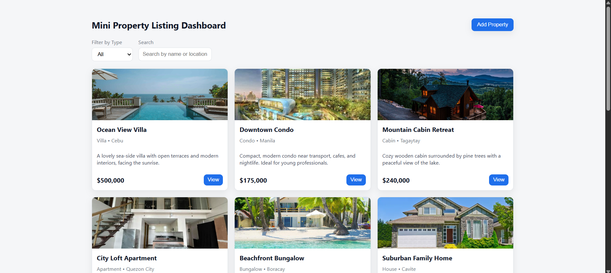
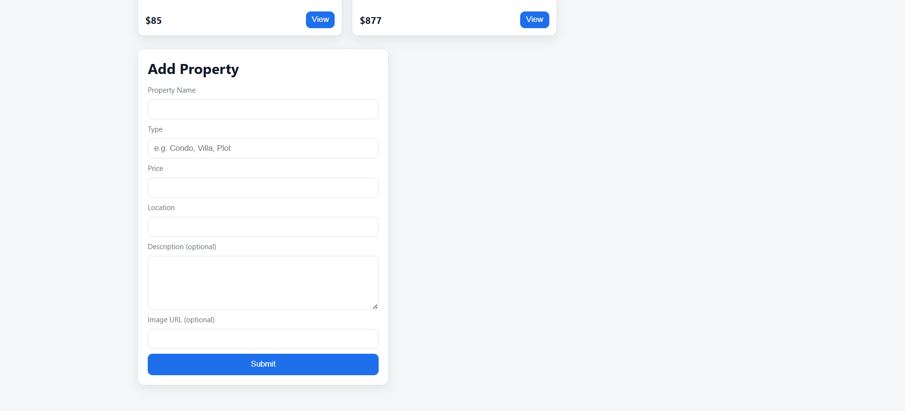
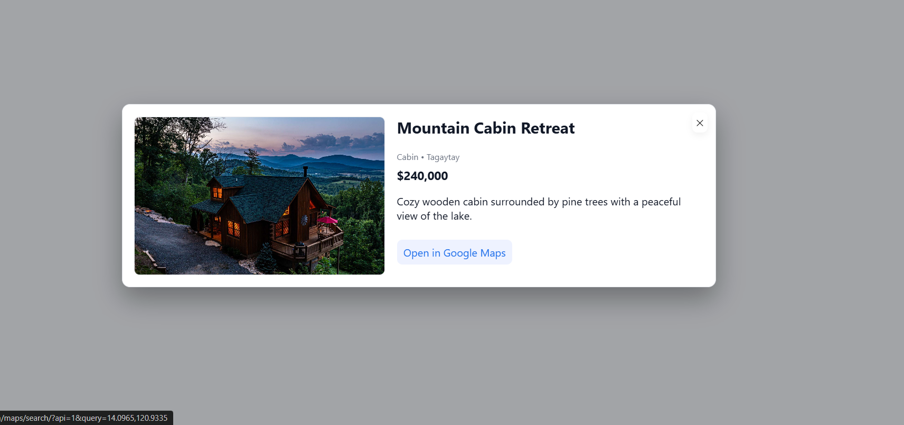

🏠 Property Dashboard

A modern React + Vite web app for managing and browsing property listings — built to demonstrate frontend skills in fetching, filtering, and managing dynamic data.

This app uses a mock backend (JSON Server) to simulate real-world API behavior and includes all the basic CRUD features you'd expect from a property management interface.

✨ Features

📋 Property Listings Page – Fetches data from a mock API and displays property cards with name, type, location, price, and short description.

🔍 Search & Filter – Filter properties by type or search by name/location for quick access.

➕ Add Property Form – Add new listings dynamically using a POST API call; the list updates instantly after submission.

👀 View Details Modal – Click “View” on any property card to open a modal showing full details, including an image and optional map preview.

🎨 Clean UI – Designed with a responsive, card-based layout and separate CSS files for easy styling and theme customization.
### 🏠 Screenshots

